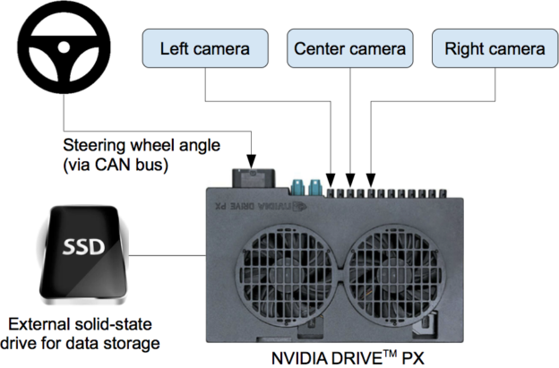
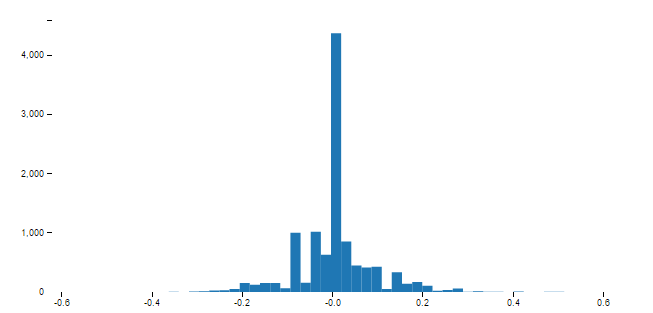
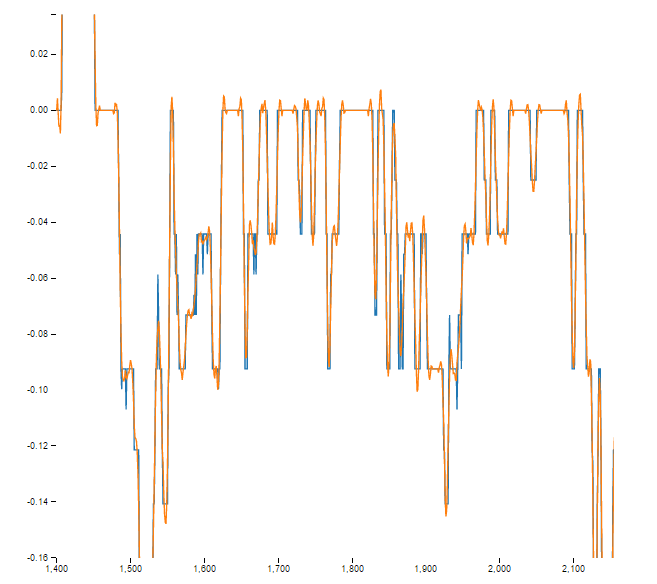

#**Behavioral Cloning Project**

The goals / steps of this project are the following:
* Use the simulator to collect data of good driving behavior
* Build, a convolution neural network in Keras that predicts steering angles from images
* Train and validate the model with a training and validation set
* Test that the model successfully drives around track one without leaving the road
* Summarize the results with a written report
* 
# Introduction

In this project we had the opportunity to investigate the use of a convolution neural network to train a model on driving a car through a simulator by only learning to match forward facing camera images in the car to turning angles, without the use of any computer vision techniques beyond basic image processing. 

This project is based on the work done by Nvidia, titled [End-to-End Deep Learning for Self-Driving Cars](https://devblogs.nvidia.com/parallelforall/deep-learning-self-driving-cars/), where only a set of images based on hours of driving in different city streets are used to train a model to drive a car autonomously. The following figure illustrates how Nvidia's data collection system is setup. The simulator we will be using in this project, which is provided by Udacity, supplies us with the same set of three images: left, right and center. 
<figure align="center">
  
  <figcaption>**Nvidia Data Collection System.** Copyright: Nvidia Corporation</figcaption>
</figure>

# Training Architecture

We will be using Nvidia's own CNN architecture shown in this following figure, but we will modify it to accept the images as per the resolution provided by the simulator, which is of size 160H x 320W x 3D 

<figure align="center">
  
  <figcaption> **Nvidia CNN Architecture.** Copyright: Nvidia Corporation</figcaption>
</figure>

The architecture starts off with a colored image, normalizes it, then runs it through 5 convolution layers and is then flattened and then connected to 5 dense layers. For our project we used Exponential Linear Units, [ELUs](https://keras.io/layers/advanced-activations/#elu) as the the activation layers.

Here is a summary of our model architecture as used in our code. 
_______________________________________________________________________________
Layer (type)                     Output Shape          Param #     Connected to
_______________________________________________________________________________
lambda_2 (Lambda)                (None, 160, 320, 3)   0   lambda_input_1[0][0]
_______________________________________________________________________________
cropping2d_2 (Cropping2D)        (None, 65, 320, 3)    0         lambda_2[0][0]
_______________________________________________________________________________
convolution2d_6 (Convolution2D)   (None, 31, 158, 24)  1824  cropping2d_2[0][0]
_______________________________________________________________________________
elu_10 (ELU)                     (None, 31, 158, 24)   0  convolution2d_6[0][0]
_______________________________________________________________________________
convolution2d_7 (Convolution2D)  (None, 14, 77, 36)    21636       elu_10[0][0]
_______________________________________________________________________________
elu_11 (ELU)                     (None, 14, 77, 36)    0  convolution2d_7[0][0]
_______________________________________________________________________________
convolution2d_8 (Convolution2D)  (None, 5, 37, 48)     43248       elu_11[0][0]
_______________________________________________________________________________
elu_12 (ELU)                     (None, 5, 37, 48)     0  convolution2d_8[0][0]
_______________________________________________________________________________
convolution2d_9 (Convolution2D)  (None, 3, 35, 64)     27712       elu_12[0][0]
_______________________________________________________________________________
elu_13 (ELU)                     (None, 3, 35, 64)     0  convolution2d_9[0][0]
_______________________________________________________________________________
convolution2d_10 (Convolution2D) (None, 1, 33, 64)     36928       elu_13[0][0]
_______________________________________________________________________________
elu_14 (ELU)                     (None, 1, 33, 64)     0 convolution2d_10[0][0]
_______________________________________________________________________________
flatten_2 (Flatten)              (None, 2112)          0           elu_14[0][0]
_______________________________________________________________________________
elu_15 (ELU)                     (None, 2112)          0        flatten_2[0][0]
_______________________________________________________________________________
dense_5 (Dense)                  (None, 100)           211300      elu_15[0][0]
_______________________________________________________________________________
elu_16 (ELU)                     (None, 100)           0          dense_5[0][0]
_______________________________________________________________________________
dense_6 (Dense)                  (None, 50)            5050        elu_16[0][0]
_______________________________________________________________________________
elu_17 (ELU)                     (None, 50)            0          dense_6[0][0]
_______________________________________________________________________________
dense_7 (Dense)                  (None, 10)            510         elu_17[0][0]
_______________________________________________________________________________
elu_18 (ELU)                     (None, 10)            0          dense_7[0][0]
_______________________________________________________________________________
dense_8 (Dense)                  (None, 1)             11          elu_18[0][0]
_______________________________________________________________________________

Total params: 348,219
Trainable params: 348,219
Non-trainable params: 0

# Preprocessing

Several preprocessing steps were used and more were tried out but did not show good results. First of all the data was skewed toward zero angle driving quite significantly, this is due to the fact that most of the driving was in straight lines. The below figure shows a histogram of the driving angles, we can clearly notice how much the data is skewed toward low to zero driving angles. This specific histogram represents data taken over normal driving around the first track. 
<figure align="center">
  
  <figcaption>**Histogram of Driving Angles** </figcaption>
</figure>

Two methods were tried to overcome this issue, the first was to randomly pop out samples that belong to bins with a high representation. This method had an indeterministic behavior and is based heavily on the driving style. It did help keep the vehicle inside the track but driving was wobbly. The other method was to try and slightly smooth the angle data using a Savitzky Golay filter. The idea is to move more angle data slightly away from dead zero angles. The figure below shows the an example difference between the sampled angle data and the smoothed data. The second method resulted in a slightly better performance than the first and the wobbling behavior was less extreme than in the case of removing samples. 

<figure align="center">
  
  <figcaption>** Smoothing of Angle Data. Blue: Original. Orange: Smoothed ** </figcaption>
</figure>

All left, center and right images were used from the data set. And a correction factor over the angle data was added for the left and right images, in a symmetric manner. In addition to that, a flipped set of images was also created to simulate the effect of driving in a mirrored track. This helped multiply the original data set by a factor of 6. 

Converting the images space to YUV was tried but did not work, it was later realized that the drive.py script needed to change in order to generate a similar color-space to the inference session. 

A python generator was used to reduce the load on the machine while feeding a large amount of image files. 

# Training
The training was initially done over the data set provided by Udacity, and the result was good. The vehicle was able to complete the track several times. Several data sets, over 10 different sets, were generated using different driving styles but was it was not possible to achieve the same level of success. A video from the data set was created and it was observed that the driving style included some intentional wiggling to offset the angle data from dead center, perhaps that was the reason why the model behaved differently on the given data set. 

Different dropout values were tested, but they did not result in a better performance. 
An Adam optimizer with the default settings was used initially which resulted in a good performance. Higher and lower learning rates were tried but resulted in a worse performance. Regularizers were also tested on the dense layers. Different number of epochs were tested, including 3,4,5,6,10 and 20. Lower epochs resulted in a better performance as higher numbers probably introduced overfitting problems. Having a decent GPU (GTX 970) helped test different settings much more quickly. 

What was also tried is using the working model which was trained on the given data set, then continue training it with new data, first by freezing the convolution layers and allowing only the dense fully connected layers to be "tuned", then by allowing all the weights to be re-tuned, as if piggy backing the given data set with a new data set and running more epochs. 

Some of the above mentioned efforts could have resulted in a better performance, but due to the nature of testing and the difficulty in assessing the performance of the model; by running the simulator, which may not provide a decent picture of how good the model performs throughout the whole track to see where it fails (can't tell how it performs at the next curve if it fails before reaching that point). 

# Project Environment
The simulator training and testing was done on a windows machine, and the neural network training was done on a linux home server with a GTX 970, which has a memory issue and requires limiting the amount of memory used to 3.5 GB out of 4. Running the simulator inference (drive.py) on the Window's GPU did not work out and had to be instead run on the CPU.

Included are the following key files
- preproc.py - which includes the image loading, augmentation and preprocessing 
- model.py - which includes the network architecture and training scripts
- model.h5 - a copy of the Keras model, the one that works
- run2.mp4 - a video of a successful autonomous drive
- drive.py - unmodified as supplied
- modeltune.py - A script to re-tune an existing model

## A few lessons learned
* Any image processing step done before feeding the learning network must be done on the images fed to the inference network
* Learning accuracy in such an application does not give a realistic indication as to how good the model will work. 
* Preprocessing data is very crucial to getting a working model, deep learning is not a magic box. 

